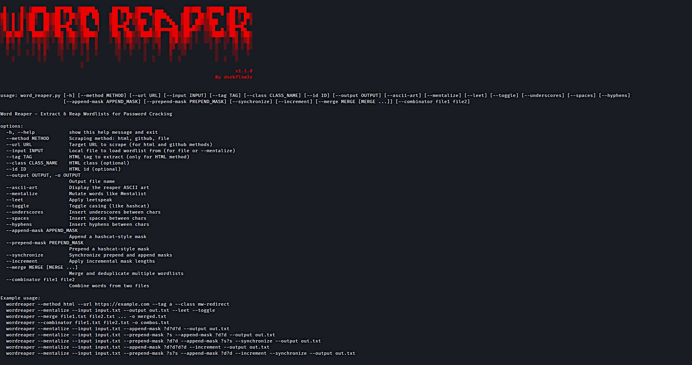

☠️ **WordReaper v1.0.0**

⚠️ **NOTICE: This project is in early development and not yet ready for production use. Features may change, break, or be incomplete. Use at your own risk.**


> Extract & Forge Wordlists for Password Cracking  
> By `d4rkfl4m3z`



---

## 💡 What is Word Reaper?

**WordReaper** is a powerful, modular tool for generating, mutating, and combining wordlists — ideal for use in password cracking and CTFs.

It supports:

- 🕸️ HTML scraping (with tag/class filtering)
- 🐙 GitHub/Gist wordlist pulling (`raw.githubusercontent.com` and `gist.githubusercontent.com`)
- 📁 Local file loading and mentalist-style mutations
- 🔄 Leetspeak, case toggling, mask-based mutations
- ⚔️ Merging and combining wordlists like a pro

---

## ⚙️ Usage

### 📥 HTML Scraping
```bash
python3 word_reaper.py --method html --url https://example.com --tag a --class content
```

### 🐙 GitHub Scraping
Supports both GitHub raw and Gist raw URLs:
```bash
python3 word_reaper.py --method github --url https://raw.githubusercontent.com/username/repo/main/file.txt
python3 word_reaper.py --method github --url https://gist.githubusercontent.com/username/gistid/raw/commitid/file.txt
```

### 📁 Local File Loading
```bash
python3 word_reaper.py --method file --input wordlist.txt
```

---

## 🧠 Wordlist Mutations

```bash
python3 word_reaper.py --mentalize --input input.txt --output mutated.txt \
--leet --toggle --underscores --append-mask ?d?d --increment
```

Supports:
- ✅ Leetspeak (`--leet`)
- ✅ Case toggling (`--toggle`)
- ✅ Separators: `--underscores`, `--spaces`, `--hyphens`)
- ✅ Masking: `--append-mask`, `--prepend-mask`, `--synchronize`, `--increment`

---

## 🧰 Other Features

### 🪓 ASCII Art
```bash
python3 word_reaper.py --ascii-art
```

### 📦 Merge Wordlists
```bash
python3 word_reaper.py --merge file1.txt file2.txt file3.txt ... -o merged.txt
```

### ⚔️ Combinator
```bash
python3 word_reaper.py --combinator adjectives.txt nouns.txt -o combos.txt
```

---

## 📝 Changelog

See [`CHANGELOG.md`](CHANGELOG.md)

---

## 📁 License

MIT

---

## 🤝 Contributions

PRs and issues welcome! Add new scrapers, modules, or mutation strategies.

Made with ☕ and 🔥 By d4rkfl4m3z

